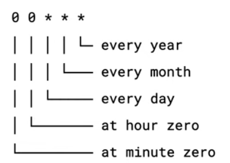

import Code from "mdx-code";
import { Head, Image, Appear } from "mdx-deck";

import { Img } from "./Img";

# Overview

<ul>
    
What is a Job ?

    
What is a Cron ?

    
Schedule ( * * * * )

    
QUEUE Fifo and Standard

    
In our codebase

</ul>

---

## What is a job ?

basically, a job is a guy who will do a task as soon as he gets to it

---

## What is a job ?

---

## What is a job ?

job will perform tasks as soon as it arrives for it

---

## What is a Cron ?

cron will schedule a time to do the tasks

---

## What is a Cron ?

---

## Cron-jobs

---

## Schedule

way to schedule tasks with cron ( * * * * * )

---

## Schedule

---

## QUEUE

Fifo or Standard

---

## QUEUE

