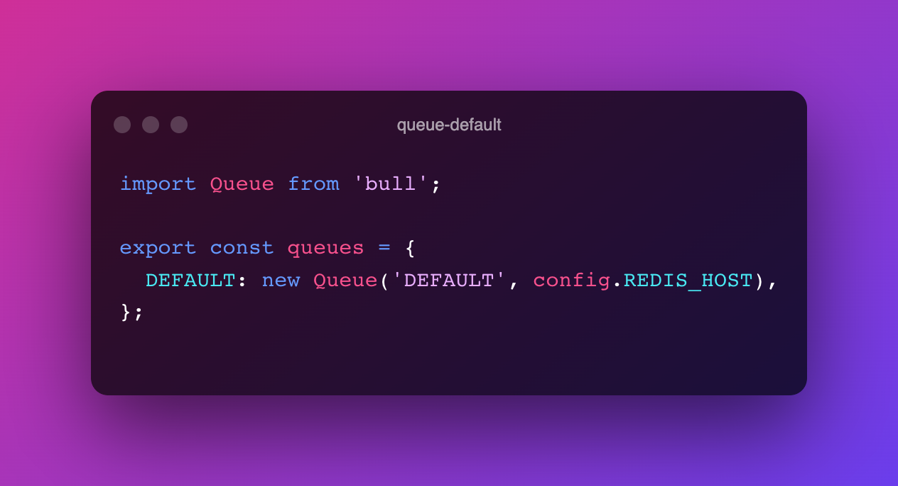
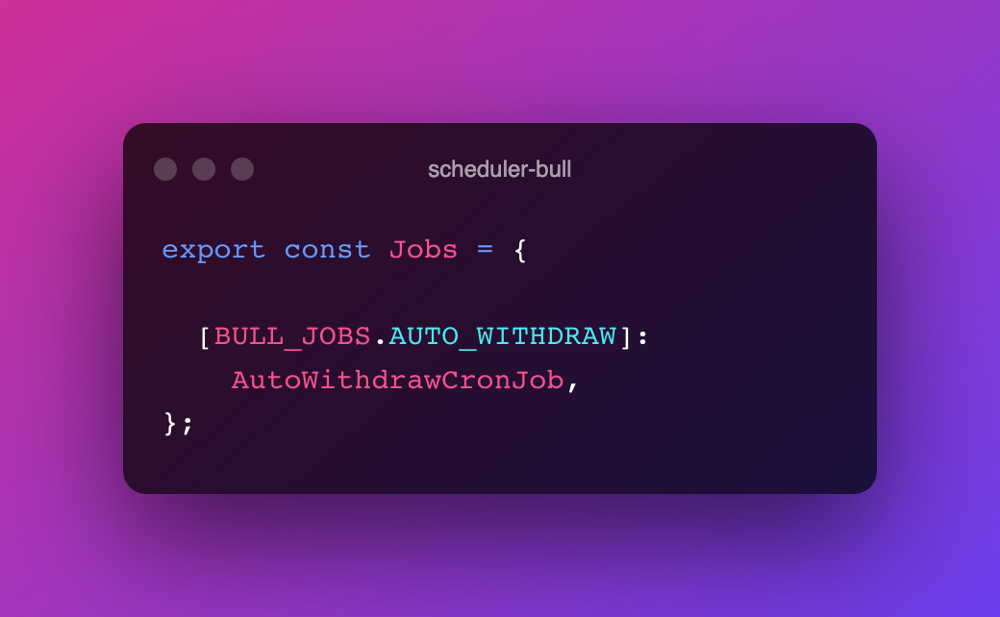
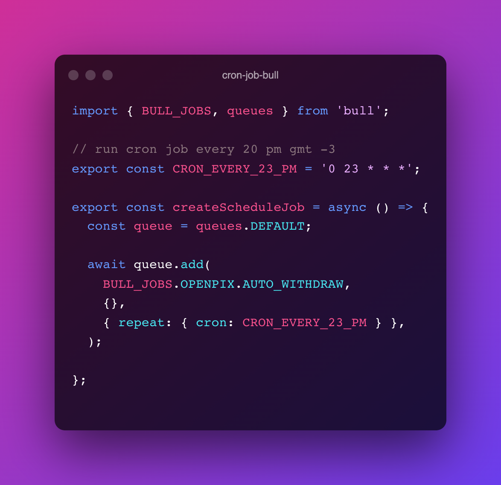

import Code from "mdx-code";
import { Head, Image, Appear } from "mdx-deck";

import { Img } from "./Img";

# Overview

<ul>
    
What is a Job ?

    
What is a Cron ?

    
Schedule ( * * * * )

    
QUEUE Fifo and Standard

    
In our codebase

</ul>

---

## What is a job ?

Worker is a guy who will do a task as soon as he gets there

---

## Why do we use a worker ?

we remove processing responsibility from our platform by passing this to the worker

---

## Worker

---

## Worker

worker will perform tasks as soon as it arrives for it

---

## What is a Cron ?

cron will schedule a time to do the tasks

---

## Cron

---

## Cron-jobs

---

## Schedule

way to schedule tasks with cron ( * * * * * )

---

## Schedule

---

## QUEUE

Fifo or Standard

---

## QUEUE

---

## QUEUE BULL

---

## Schedule BULL

---

## Cron BULL

---

## References

- [Cron](https://en.wikipedia.org/wiki/Cron)
- [Fifo vs standard](https://cloudaffaire.com/sqs-standard-vs-fifo-queue/)

---

# Thanks